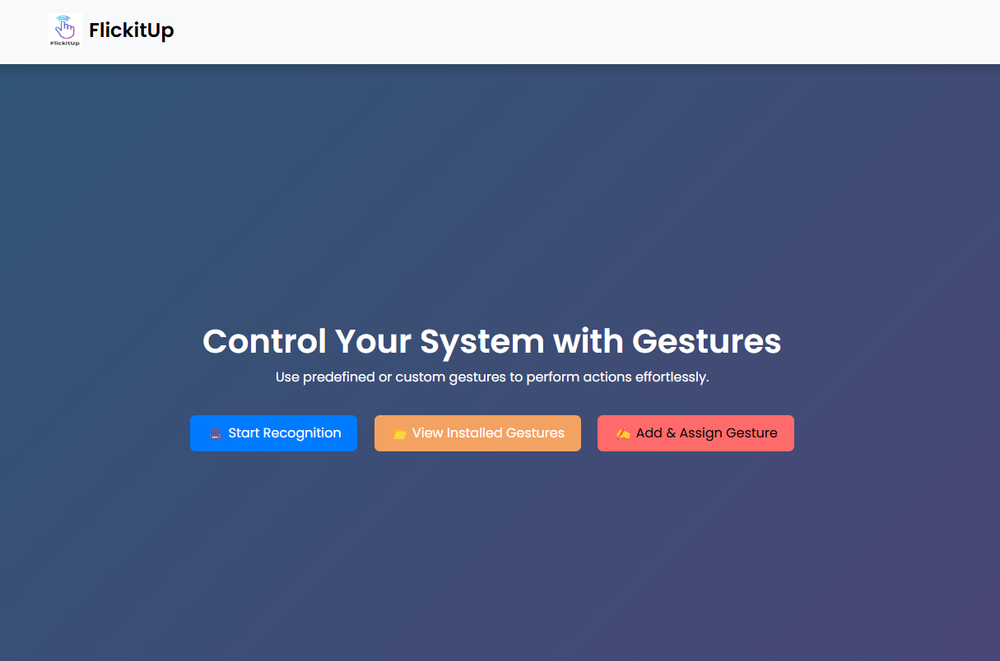
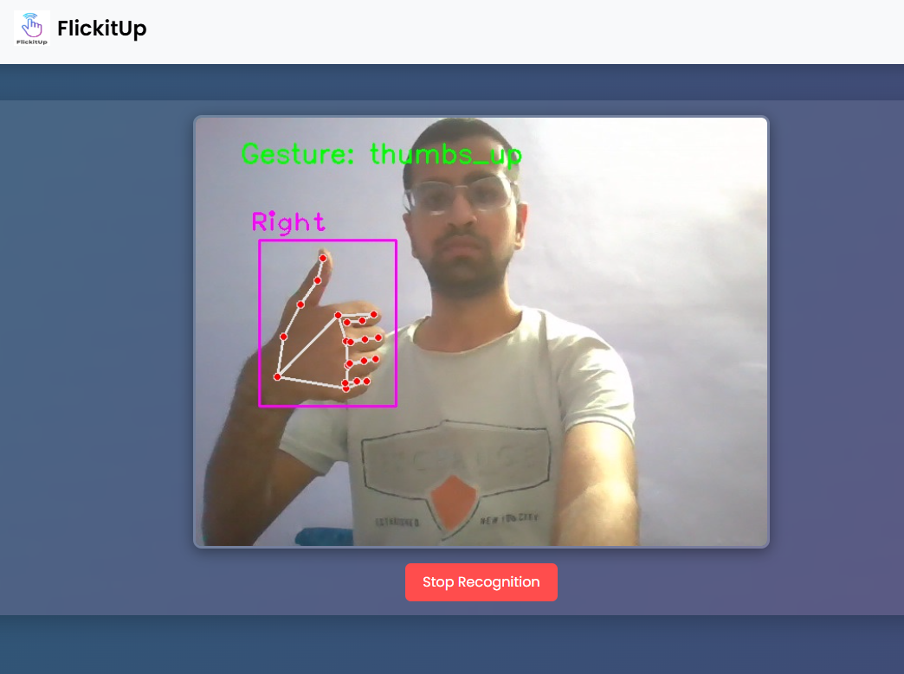

# **Gesture Recognition System** ✋🤖  

A Flask-based **gesture recognition system** using OpenCV, TensorFlow, and HandTracking. The system detects predefined/user-defined gestures and executes corresponding actions.  

---

## **🚀 Features**  
✅ **Real-time Gesture Detection** using OpenCV & TensorFlow  
✅ **Predefined & User-defined Gestures** for custom actions  
✅ **Smooth Predictions** with gesture smoothing   
✅ **Mouse Control Support** using gestures  

---

## **🛠 Tech Stack**  
- **Frontend:** HTML, CSS, JavaScript  
- **Backend:** Flask (Python)  
- **Machine Learning:** TensorFlow, OpenCV  

---

## **📌 Installation**  
1. **Clone the Repository**  
   ```sh
   git clone https://github.com/Aayush6377/INOSKILL-2025-FlickitUp-.git
   cd FlickitUp

2. **Install Dependencies**  
   ```sh
   pip install -r requirements.txt
   
3. **Run the Application**  
   ```sh
   python app.py

## **📌 Screenshots**  
### Home Page  
  

### Gesture Recognition in Action  
  

## **👨‍💻 Team Members**  
- [Aayush Kukreja](https://github.com/Aayush6377)  
- [Sankit Singhal](https://github.com/SankitSinghal)  
- [Sushil Gupta](https://github.com/SGgithub001)  
